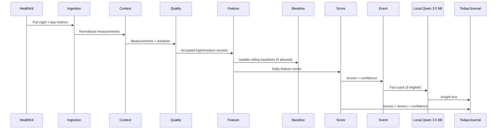

# Somatiq Core Engine — Production Algorithm (On‑Device)

Версия: 1.1  
Дата: 2026-03-05  
Статус: Production specification (детерминированный engine + политика качества + события + LLM policy).

> Этот документ описывает **продакшн‑алгоритм** on‑device ядра Somatiq:
> - что и как собирать,
> - как нормализовать,
> - как оценивать качество,
> - как извлекать фичи,
> - как строить baseline,
> - как считать скоры и детектировать аномалии,
> - как безопасно генерировать инсайты локальным LLM.
>
> **Цель — устойчивые и объяснимые результаты** при реальных “грязных” данных (пропуски, смена устройств, артефакты PPG, шумные дни).

### AI runtime (фиксировано для production)

- Основная AI‑модель: **Qwen 3.5 9B**.
- Fallback для слабых устройств: **Qwen 3.5 0.9B Lite** (0.9B‑class quantized profile).
- Обе модели работают **полностью на устройстве** (on-device inference).
- Передача персональных health‑данных в облачные LLM не используется в production‑потоке инсайтов.

---

## 0) Change log

- **v1.1 (2026‑03‑05)**: уточнены определения окон/бинов, добавлены строгие правила нормализации, source‑reliability, минимальные размеры выборок, winsorization, baseline update policy, multi‑metric out‑of‑range, контракт fact‑pack для LLM, версия алгоритма и recompute‑логика.

---

## 1) Цель ядра

Построить **приватный on‑device data engine**, который:

1. Считает физиологические метрики **только из качественных данных**.
2. Даёт устойчивые скоры (`Stress`, `Sleep`, `Battery`, `Heart`) через baseline‑модель.
3. Не интерпретирует шум как “состояние”.
4. Генерирует инсайты через локальный LLM **только из проверенных фактов**.
5. Поддерживает **пере‑расчёт** (recompute) при обновлении алгоритма без деградации истории.

---

## 2) Принципы продакшн‑алгоритма

- **Quality‑first:** любой скор считается только после quality gate.
- **Baseline‑first:** интерпретация только относительно персональной нормы.
- **Context‑aware:** стресс оценивается только в rest‑окнах; сон — в ночных окнах.
- **Transparent:** для каждого скора храним факторы, пороги и confidence + причины “почему не посчитали”.
- **Medical‑safe:** без диагнозов; только “out of typical range” и low‑risk действия.
- **Deterministic by default:** ядро (quality/features/scores/events) детерминированное. LLM — только слой объяснения.
- **Source‑aware:** baseline и доверие считаются *в разрезе источника/типа метрики*, чтобы не смешивать несопоставимые потоки.
- **Recompute‑ready:** любой derived объект хранит `algoVersion` и может быть пересчитан.

---

## 3) Слои архитектуры


---

## 4) Глоссарий и определения

### 4.1 День и “ночь”

**Ключевое продакшн‑решение:** ночные показатели относим к дню **по времени пробуждения**.

- `sleep_day` = локальная дата `wakeTime` (конец основного сна).
- `night_window` = интервал основного сна (см. 8.1).
- Это предотвращает “разрыв ночи по полуночи” и даёт стабильные дневные отчёты.

### 4.2 Окна и состояния активности

- `asleep`: внутри `night_window`.
- `rest`: низкая активность и стабильная поза (см. 7.2.2), вне сна.
- `active`: всё остальное (ходьба, тренировка, частые движения).

### 4.3 Метрики HRV

- `RMSSD` (ms): корень из среднего квадрата разностей соседних RR.
- `lnRMSSD`: `ln(RMSSD)` (натуральный логарифм). Внутренне **предпочтителен** для baseline/скоринга.
- `SDNN` (ms): стандартное отклонение RR.
- **Важно:** `SDNN` и `RMSSD` не взаимозаменяемы. Не пытаться “конвертировать” одно в другое. Хранить и бейзлайнить отдельно.

### 4.4 Robust statistics

- `median`: медиана.
- `IQR`: interquartile range = `P75 - P25`.
- `robust_z(x) = (x - median) / max(IQR, eps)`.

### 4.5 Confidence

- `confidence` (0..1) = оценка, насколько мы доверяем вычисленным фичам/скорам.
- `qualityClass`:
  - `high`: `>= 0.85`
  - `medium`: `0.70..0.84`
  - `low`: `0.50..0.69`
  - `rejected`: `< 0.50`

---

## 5) Режимы сбора данных

### 5.1 Режимы

- `night_passive` — основной источник устойчивых данных (сон/ночной HRV).
- `morning_test` — активный стандартизованный тест (1–5 минут).
- `day_rest` — короткие окна в покое (стресс/восстановление).
- `day_active` — активность/нагрузка (контекст и drain).

### 5.2 Оркестрация

- Ночной батч: 1 раз в день после пробуждения (например, 04:30–10:00 локально).
- Почасовой lightweight refresh: контекст/активность/battery.
- On‑demand refresh: pull‑to‑refresh.
- EMA/теги: 2–3 чек‑ина в день (опционально).

---

## 6) Data model (on-device)

### 6.1 Сырые измерения

`MeasurementRecord`

- `id: UUID`
- `timestamp: Date` (UTC в storage; локальное время — только для UI/окон)
- `source: enum` (`apple_watch`, `healthkit_import`, `camera_ppg`, `ble_ecg`, `third_party`)
- `sourceDeviceId: String?` (стабильный идентификатор устройства/модели, если доступен)
- `mode: enum` (`night_passive`, `morning_test`, `day_rest`, `day_active`, `unknown`)
- `metricType: enum` (`rr`, `hrv_rmssd`, `hrv_sdnn`, `hr`, `rhr`, `sleep`, `activity`, `temp`, `resp`, `spo2`)
- `valuePrimary: Double` (в канонических единицах; см. 6.4)
- `valueSecondary: Double?` (напр. min/max, или confidence источника)
- `durationSec: Int`
- `sampleCount: Int`
- `qualityConfidence: Double` (0..1) — итоговая confidence записи
- `qualityClass: enum` (`high`, `medium`, `low`, `rejected`)
- `qualityFlags: [String]` — причины/флаги
- `activityState: enum` (`asleep`, `rest`, `active`, `unknown`)
- `algoVersion: String` (версия нормализации/quality)
- `ingestedAt: Date`

> Примечание: если source даёт series (HR samples, RR samples), допустимы “batch records” (one record per window) или “sample records”. В проде предпочтительнее:
> - series хранить агрегированно (чтобы не раздувать БД),
> - raw series хранить только при явной debug‑опции.

### 6.2 Производные фичи

`DerivedFeatureDaily`

- `day: Date` (sleep_day)
- `mainSleepStart: Date?`, `mainSleepEnd: Date?`
- `RMSSD_night: Double?`, `lnRMSSD_night: Double?`, `SDNN_night: Double?`
- `HR_mean_night: Double?`, `RHR_night: Double?`, `HR_min_night: Double?`
- `sleepDurationMin: Int?`, `timeInBedMin: Int?`, `sleepEfficiency: Double?`
- `awakeAfterSleepOnsetMin: Int?`, `sleepMidpointLocalMin: Int?`
- `respRate_night: Double?`, `tempDelta_night: Double?`, `spo2_night: Double?`
- `steps: Int?`, `activeCalories: Int?`
- `loadDaily: Double?`, `load2h: Double?`, `load7d: Double?`, `load28d: Double?`
- `sleepDebtMin: Int?`
- `dataCoverageNight: Double` (0..1)
- `dataCoverageRest: Double` (0..1)
- `featureConfidence: Double` (0..1)
- `featureFlags: [String]`
- `algoVersion: String`
- `computedAt: Date`

### 6.3 Бейзлайн

`BaselineProfile`

- `metric: String` (например `lnRMSSD_night`)
- `timeBin: enum` (`night`, `morning`, `day`, `evening`, `rest`)
- `window: enum` (`w7`, `w28`, `w60`)
- `sourceGroup: enum` (`watch_ppg`, `ecg`, `camera_ppg`, `mixed`) — см. 7.3.2
- `median: Double`
- `iqr: Double`
- `p10: Double?`, `p90: Double?` (для winsorization)
- `sampleCount: Int`
- `updatedAt: Date`
- `algoVersion: String`

### 6.4 Скоры, факторы и события

`ScoreSnapshot`

- `timestamp: Date` (когда пересчитали)
- `day: Date` (sleep_day)
- `stressScore: Int?` (0..100)
- `sleepScore: Int?`
- `batteryScore: Int?`
- `heartScore: Int?`
- `confidence: Double` (0..1) — итоговая confidence snapshot
- `confidenceBreakdownJSON: Data` (опционально)
- `dominantDriver: String?`
- `driversJSON: Data` (список факторов/вкладов)
- `outOfRangeLevel: enum` (`none`, `minor`, `major`)
- `eventsJSON: Data`
- `algoVersion: String`
- `computedAt: Date`

---

## 7) Normalization + Context + Quality (критический слой)

### 7.1 Normalization layer (единицы, дедуп, канонизация)

**Единицы (канон):**
- HR/RHR: **bpm**
- RR: **ms**
- RMSSD/SDNN: **ms**
- Temperature: **°C delta** (от baseline) или абсолютная °C (но в скоринг лучше delta)
- Respiratory rate: **breaths/min**
- SpO₂: **%**
- Steps: count
- Active calories: kcal

**Дедупликация:**
- Ключ: `(source, metricType, timestamp, durationSec, valuePrimary)` с допуском ±2s по timestamp.
- Если пришли дубль‑записи: сохраняем одну, повышая `sampleCount`/coverage, но не удваиваем вклад.

**Нормализация времени:**
- В storage: UTC.
- Окна/дни: считаем в локальном TZ пользователя.
- Любой record получает `sleep_day`/`activityState` на этапе Context Engine.

### 7.2 Context Engine (классификация sleep/rest/active)

#### 7.2.1 Определение основного сна (`main sleep`)
В сутки (по локальному времени) выбираем **одну** главную сессию сна:

1) Собрать `sleep segments` из источников сна (asleep/inBed).
2) Рассматривать окно поиска: `18:00 предыдущего дня` → `12:00 текущего дня`.
3) Сформировать кандидаты “сессий сна” (склеить сегменты, если разрыв < 90 минут).
4) Выбрать сессию с максимальной `asleep duration`.
5) `mainSleepStart`, `mainSleepEnd` = границы выбранной сессии.
6) Если нет данных сна:
   - fallback: “pseudo sleep” по самому длинному периоду низкой активности ночью (опционально),
   - иначе ночные фичи считаем как `missing`.

#### 7.2.2 Определение rest‑окон (`rest windows`)
Rest‑окно — это минимальный интервал, где физиология сопоставима (и можно считать Stress):

- Длина окна: `>= 5 минут` (MVP) / `>= 10 минут` (лучше).
- Условия:
  - нет workout‑события в последние 60 минут,
  - шаги/движение низкие: `steps_in_window <= 5` или `accel_variance < threshold`,
  - HR не в тренировочной зоне (если зоны доступны),
  - окно **не** пересекается с `main sleep`.

Если нет акселерометра:
- использовать шаги/standing minutes,
- или HR‑стабильность: `std(HR) < 6 bpm` в окне как слабый прокси.

#### 7.2.3 Назначение `mode` и `activityState`
- Если record внутри `main sleep` → `mode=night_passive`, `activityState=asleep`.
- Иначе если попадает в rest‑окно → `mode=day_rest`, `activityState=rest`.
- Иначе если workout/активность → `mode=day_active`, `activityState=active`.
- Иначе → `mode=unknown`, `activityState=unknown`.

### 7.3 Quality Engine

#### 7.3.1 Общий подход
Качество считаем как композицию:

- `Q_signal` — сигнал/coverage/артефакты (насколько метрика физически надежна).
- `Q_context` — корректность контекста (сон/покой/активность).
- `Q_source` — надёжность источника (ECG > watch PPG > camera PPG …).

Финальная формула:

```text
confidence = clamp(
  0.55 * Q_signal +
  0.25 * Q_context +
  0.20 * Q_source,
  0.0, 1.0
)
```

#### 7.3.2 Source reliability (`Q_source`) — карта по группам
В проде важно хранить **не только source**, но и `sourceGroup`:

- `ecg` (ble_ecg / validated RR)
- `watch_ppg` (apple_watch HR/HRV)
- `camera_ppg` (finger PPG тесты)
- `mixed` (healthkit_import без уверенного устройства)

Предлагаемые веса (можно настроить конфигом):

| sourceGroup | Q_source |
|---|---:|
| ecg | 1.00 |
| watch_ppg | 0.85 |
| camera_ppg (morning_test) | 0.80 |
| camera_ppg (day_rest) | 0.70 |
| mixed/unknown | 0.60 |

Доп. правила:
- если источник поменялся (новое устройство), первые 3–5 дней понижаем `Q_source` на 0.05–0.10, пока baseline “не адаптируется”.

#### 7.3.3 `Q_signal` для RR‑серий (ECG/PPG)
Для RR‑серии (или HRV, посчитанной из RR) считаем:

- `duration_ok = clamp(durationSec / targetDurationSec, 0..1)`
  - target: 300s для night segments, 120s для morning_test, 300s для rest windows.
- `count_ok = clamp(sampleCount / targetRRCount, 0..1)`
  - targetRRCount ≈ durationSec * HR/60 (если HR неизвестен, использовать 60 bpm).
- `artifact_ratio = (#outliers + #gaps) / sampleCount`
- `artifact_ok = 1 - clamp(artifact_ratio / 0.15, 0..1)`  
  (0.15 = “плохой” порог, настраиваемый)
- `physio_ok`: доля RR в [300ms..2000ms] (иначе флаг)
- `stability_ok`: для rest windows `std(HR) < 6 bpm` (если доступно)
- `morphology_ok`: только для camera_ppg (опционально): стабильность формы (если есть CWT/quality score)

```text
Q_signal = clamp(
  0.30*duration_ok +
  0.25*count_ok +
  0.25*artifact_ok +
  0.10*physio_ok +
  0.10*stability_ok,
  0..1
)
```

Флаги:
- `insufficient_duration`
- `insufficient_samples`
- `artifact_ratio_high`
- `rr_out_of_range`
- `unstable_hr`

#### 7.3.4 `Q_signal` для HealthKit‑агрегатов (без raw)
Если источник даёт только точечные значения (например, SDNN samples):

- `count_ok = clamp(sampleCount / targetCount, 0..1)`  
  targetCount: 6 (хотя бы 6 значений за ночь) или 3 за rest‑период.
- `coverage_ok = dataCoverageNight` / `dataCoverageRest`
- `plausibility_ok`: метрика в физиологических границах:
  - SDNN: 5..250 ms
  - HR: 30..220 bpm
  - SpO2: 70..100 %
- `consistency_ok`: медиана за ночь не прыгает на > 3*IQR относительно 60d baseline (если baseline есть)

```text
Q_signal = clamp(
  0.35*coverage_ok +
  0.30*count_ok +
  0.20*plausibility_ok +
  0.15*consistency_ok,
  0..1
)
```

#### 7.3.5 `Q_context`
- Если метрика “ночная” (…_night), но записи не внутри main sleep → `Q_context = 0` и флаг `not_in_sleep`.
- Для Stress:
  - если окно не rest → `Q_context = 0` и флаг `not_rest_window`.
- Для morning_test:
  - если начался позже чем через 90 минут после wake → `Q_context -= 0.2` (флаг `late_morning_test`).

#### 7.3.6 Политика gate (разные пороги для разных задач)

**1) Raw журнал:**
- хранить `high|medium|low` (и `rejected` только если debug включён).

**2) Feature вычисления:**
- RR‑фичи: только `high|medium`.
- Sleep duration/time‑in‑bed: можно `low`, но помечать флагом.

**3) Baseline update:**
- только если `featureConfidence >= 0.80` и нет критических флагов.

**4) Score update:**
- `>= 0.70` — обновляем скор, но если 0.70–0.79, UI помечает “medium”.
- `< 0.70` — держим последний валидный.

**5) Event/notification:**
- только если `>= 0.80` и baseline_ready=true.

---

## 8) Feature Engine

### 8.1 Nightly HR/HRV: сегментация и агрегация

#### 8.1.1 Сегменты 5 минут
Внутри `main sleep` формируем сегменты по 5 минут:

- сегмент считается валидным, если:
  - `duration >= 240s` (допускаем пропуски),
  - `RR_count >= 200` (или пропорционально длительности),
  - `segment_confidence >= 0.75`.

Для каждого сегмента считаем:
- RMSSD, lnRMSSD, SDNN, HR_mean, HR_min.

#### 8.1.2 Aggregation по ночи (robust)
Чтобы один “плохой кусок” не ломал ночь:

- `night_metric = median(segments_metric)`  
- Дополнительно: можно trimmed mean (например, отбросить 10% хвостов), но в MVP достаточно median.

`dataCoverageNight = total_valid_segment_duration / mainSleepDuration`

### 8.2 Morning test (1–5 минут)
- Считаем из RR так же, как сегмент.
- Если `duration < 60s` или `RR_count < 50` → `rejected`.

### 8.3 Rest windows (дневной “физиологический покой”)
- Генерируем список rest‑окон длиной 5–15 минут.
- Для каждого окна считаем `lnRMSSD_rest`, `HR_rest`, `RHR_rest` (если есть).
- Для Stress используем **наихудшее** (максимальный stress_raw) окно за день *или* median по окнам (конфиг).  
  Продакшн‑по умолчанию: median (устойчивее), а “наихудшее” использовать только как driver.

### 8.4 Сон: фичи
Из main sleep:

- `sleepDurationMin` = сумма asleep.
- `timeInBedMin` = сумма inBed (если есть).
- `sleepEfficiency` = sleepDuration / timeInBed (если timeInBed доступно, иначе null).
- `WASO` = awakeAfterSleepOnsetMin (если awake segments доступны).
- `sleepMidpointLocalMin` = midpoint main sleep в минутах от 00:00 (локально).

### 8.5 Нагрузка (load)
Цель load — не “идеальный спорт‑индекс”, а **стабильный контекст** для скоринга/дренажа.

#### 8.5.1 Daily load (детерминированный)
Приоритетный порядок (fallback):

1) Если доступны HR zones minutes:
   - `loadDaily = Σ minutes_in_zone[z] * zoneWeight[z]`
   - веса: z1=1, z2=2, z3=3, z4=4, z5=5
2) Иначе если есть activeCalories:
   - `loadDaily = activeCalories / 10` (калибровочный коэффициент, конфиг)
3) Иначе:
   - `loadDaily = steps / 1000`

#### 8.5.2 Скользящие окна
- `load2h` = load за последние 2 часа (по workout сегментам/HR zones/steps).
- `load7d` = сумма `loadDaily` за 7 дней.
- `load28d` = сумма за 28 дней.
- `load7vs28 = (load7d/7) / max(load28d/28, eps)`.

### 8.6 Sleep debt (для Battery/Recovery)
Простая production‑версия без “медицинских норм”, baseline‑first:

- `sleepNeedMin = max( baseline_sleepDuration_w60, 7h )` *если baseline готов*, иначе 7h.
- `sleepDebtMin_today = clamp(sleepNeedMin - sleepDurationMin, 0..240)`
- `sleepDebtMin_rolling = clamp( EMA(sleepDebtMin_today, alpha=0.3), 0..600 )`

---

## 9) Baseline Engine

### 9.1 Окна baseline
- `w7` — короткий тренд.
- `w28` — личная “норма” (основной референс).
- `w60` — стабилизация и долгий контур.

### 9.2 Time bins
Чтобы метрики из разных частей суток не смешивались:

- `night`: main sleep
- `morning`: 05:00–11:00 (или “до 2 часов после wake”)
- `day`: 11:00–17:00
- `evening`: 17:00–23:00
- `rest`: только rest windows (вне сна)

### 9.3 Минимальные требования (baseline readiness)
Для каждого baseline профиля:

- `w7`: `sampleCount >= 4`
- `w28`: `sampleCount >= 10`
- `w60`: `sampleCount >= 20`

Если недостаточно:
- fallback на более широкое окно (28 → 60),
- или на более общий bin (morning → day),
- или baseline считается `not_ready`.

### 9.4 Winsorization
Перед robust_z применяем winsorization:

- `x_clipped = clamp(x, p10, p90)` если `p10/p90` доступны.
- Иначе: `x_clipped = clamp(x, median - 3*IQR, median + 3*IQR)`.

Это защищает от “одного плохого дня”.

### 9.5 Warm‑up политика
- `<7 дней`: показываем raw + Sleep duration + “data status”, скоры не считаем или считаем в demo‑режиме без событий.
- `7–21 дней`: preliminary scoring без major events.
- `>=21 день`: full scoring + events.

---

## 10) Score Engine (production formulas)

### 10.1 Общие функции
```text
sigmoid_k(x) = 1 / (1 + exp(-k*x)),  k=0.9 (конфиг)
toScore01(x) = clamp(sigmoid_k(x), 0..1)
toScore100(x) = round(100 * toScore01(x))
```

### 10.2 Stress Score (0..100)
**Только** rest windows (и/или night recovery window), иначе `null`.

Входы:
- `lnRMSSD_rest_today`
- `HR_rest_today` или `RHR_rest_today`
- `load2h`

Бейзлайны:
- `baseline_lnRMSSD_w28_rest`
- `baseline_HR_w28_rest`
- `baseline_load2h_w28`

```text
z_hrv   = robust_z( winsor(lnRMSSD_rest), baseline_lnRMSSD_w28_rest )
z_hr    = robust_z( winsor(HR_rest),      baseline_HR_w28_rest )
z_load2 = robust_z( winsor(load2h),       baseline_load2h_w28 )

contextPenalty = 0
+ 0.15 if tag_alcohol_last_12h
+ 0.10 if jetlag_tag
+ 0.10 if illness_suspected_event
(конфиг, но только как мягкая поправка)

stress_raw =
  0.55 * (-z_hrv) +
  0.30 * ( z_hr) +
  0.15 * ( z_load2) +
  contextPenalty

stress_score = toScore100(stress_raw)
```

**Driver logging:**
- сохранить `z_hrv`, `z_hr`, `z_load2`, `contextPenalty` и вклад каждого.

### 10.3 Sleep Score (0..100)
Входы:
- duration, efficiency, WASO, timing, ночной HRV/RHR.

Компоненты:

1) `duration_component` (0..100)
```text
d = sleepDurationMin
need = sleepNeedMin
delta = d - need
duration_component = clamp( 100 - abs(delta)/need * 120, 0..100 )
```

2) `efficiency_component` (если есть)
```text
eff = sleepEfficiency (0..1)
efficiency_component = clamp( (eff - 0.75) / (0.95 - 0.75) * 100, 0..100 )
```
Если efficiency нет → использовать WASO/пробуждения как прокси или снизить вес.

3) `timing_consistency_component`
Сравниваем midpoint сна с baseline midpoint (w60):

```text
mid = sleepMidpointLocalMin
mid0 = baseline_midpoint_w60
diff = circular_minutes_distance(mid, mid0)  # 0..720
timing_consistency_component = clamp(100 - diff/180*100, 0..100)
```

4) `recovery_component`
```text
z_hrv_n = robust_z( winsor(lnRMSSD_night), baseline_lnRMSSD_w28_night )
z_rhr_n = robust_z( winsor(RHR_night),     baseline_RHR_w28_night )

recovery_component = clamp( 50 + 25*z_hrv_n - 15*z_rhr_n, 0..100 )
```

Итог:

```text
sleep_score =
  0.35 * duration_component +
  0.20 * efficiency_component +
  0.20 * timing_consistency_component +
  0.25 * recovery_component
```

> Весами можно управлять конфигом, но **фиксировать в algoVersion**.

### 10.4 Battery Score (0..100) — day‑anchored state model

#### 10.4.1 Утренний якорь (после сна)
```text
battery_morning =
  clamp(
    35
    + 0.35*sleep_score
    + 20*toScore01( 0.9*(z_hrv_night - 0.6*z_rhr_night) ),
    0..100
  )
```

#### 10.4.2 Почасовое обновление
На каждом часе:

```text
drain_activity = clamp( load_last_hour * 2.0, 0..25 )
drain_stress   = clamp( stress_minutes_last_hour/60 * 8.0, 0..12 )
drain_wake     = 1.5  # базовый расход “просто живём” (конфиг)

charge_rest = 0
+ 2.0 if rest_window >= 20 min and stress_score < 45

battery_t =
  clamp(
    battery_(t-1) + charge_rest - drain_activity - drain_stress - drain_wake,
    0..100
  )
```

#### 10.4.3 Публикация
- UI показывает дневную кривую и текущее значение.
- Если данных активности мало → `drain_activity` = 0 и флаг `low_activity_coverage`.

### 10.5 Heart Score (0..100) — resilience proxy (baseline + стабильность)

Входы:
- ночной lnRMSSD (положение относительно w60),
- тренд 7d,
- волатильность 7d.

```text
z_hrv_60 = robust_z( winsor(lnRMSSD_night), baseline_lnRMSSD_w60_night )
trend7   = robust_z( median(lnRMSSD_last7) , baseline_lnRMSSD_w60_night )  # грубо
vol7     = stddev(lnRMSSD_last7)

vol_penalty = clamp( (vol7 - target_vol) / target_vol, 0..1 )
# target_vol = median(vol7 over 60d) or fixed 0.10 (конфиг)

heart_raw =
  0.65*z_hrv_60 +
  0.20*trend7 -
  0.15*(2.0*vol_penalty)

heart_score = clamp( round(50 + 20*heart_raw), 0..100 )
```

### 10.6 Confidence-aware output policy (разделение порогов)

- `score_confidence = min(featureConfidence, baselineReadinessFactor)`
- `baselineReadinessFactor`:
  - 0.0 если baseline not_ready
  - 0.7 если preliminary
  - 1.0 если full_ready

Политика:
- если `score_confidence < 0.70`:
  - **не обновляем** скор (держим last reliable),
  - сохраняем snapshot с причиной “why not computed”.
- если `>= 0.70`:
  - считаем/обновляем.

---

## 11) Event Engine (out-of-range)

### 11.1 Typical range
Для каждой метрики определяем “типичный диапазон”:

- `lower = median - 1.5*IQR`
- `upper = median + 1.5*IQR`

### 11.2 Multi-metric detector (Vitals‑паттерн)
Список ночных метрик (если доступны):
- `lnRMSSD_night` (низко — плохо)
- `RHR_night` (высоко — плохо)
- `respRate_night` (высоко — иногда плохо)
- `tempDelta_night` (высоко — иногда плохо)
- `spo2_night` (низко — плохо)
- `sleepDurationMin` (низко — иногда плохо)

Для каждой считаем `out_flag` и `severity` (насколько далеко от диапазона, в IQR единицах).

```text
severity = max(0, (x - upper)/IQR, (lower - x)/IQR)
out_count = count(severity >= 1.0)
major_count = count(severity >= 1.5)
```

### 11.3 Minor / Major

**Minor**, если:
- `out_count >= 1` два дня подряд, ИЛИ
- `stress_score > 75` в 2+ rest‑окнах подряд, ИЛИ
- `sleep_score < 45` 2 ночи подряд, ИЛИ
- `battery < 30` более 6 часов.

**Major**, если:
- `major_count >= 2` в одну ночь, ИЛИ
- (классический паттерн) `lnRMSSD_night` ниже baseline на `>1.5 IQR` **и** `RHR_night` выше baseline на `>1.0 IQR` в 2+ ночи, ИЛИ
- `out_count >= 2` в 2 ночи подряд.

**Ограничения:**
- учитывать только если `score_confidence >= 0.80`.
- в warm‑up (`<21 день`) не выдавать major.

### 11.4 Политика уведомлений
- не более 2 push в сутки,
- cooldown: 12 часов между уведомлениями,
- текст строго “вне вашего типичного диапазона”,
- всегда добавлять “возможные причины” как гипотезы, а не утверждения,
- если major повторяется 3 дня подряд → “consider professional help” (без медицинских диагнозов).

---

## 12) Insight Policy Engine + Local LLM (Qwen 3.5 9B)

### 12.1 Роли: что делает LLM (Qwen 3.5 9B on-device)
LLM **не** считает метрики. Он:
- объясняет факты,
- формулирует мягкие гипотезы,
- предлагает low‑risk действия,
- помогает пользователю понять “что повлияло”.

### 12.2 Fact-pack контракт (строгая схема)
LLM получает **только** fact-pack (никаких raw series).

Минимальная схема:

```json
{
  "algoVersion": "1.1",
  "day": "2026-03-05",
  "confidence": 0.82,
  "confidenceReasons": ["rest_coverage_ok", "baseline_ready", "watch_ppg"],
  "scores": { "stress": 68, "sleep": 54, "battery": 42, "heart": 61 },
  "drivers": [
    { "name": "lnRMSSD_night", "value": 3.12, "z": -1.1, "direction": "low" },
    { "name": "RHR_night", "value": 62, "z": 0.8, "direction": "high" },
    { "name": "sleep_duration_min", "value": 392, "delta_min": -52 }
  ],
  "events": [
    { "type": "out_of_range", "level": "minor", "metrics": ["lnRMSSD_night"] }
  ],
  "contextTags": ["late_meal", "hard_workout"],
  "safeActions": [
    "easy_walk_20min",
    "earlier_bedtime_30min",
    "hydration"
  ],
  "bannedActions": [
    "change_medication",
    "diagnose_condition"
  ]
}
```

### 12.3 Генеративная политика (строгие правила)
LLM должен:
1) 1 короткий summary (1–2 предложения).
2) 1–3 *гипотезы* “почему могло быть так” (формулировки: “возможно”, “часто связано”, “может быть”).
3) 1–2 low‑risk действия (сон/прогулка/гидрация/дыхание/легкая растяжка).
4) Если `major`: совет “если чувствуете себя плохо или симптомы усиливаются — обратитесь к врачу”.
5) Никогда не:
   - ставить диагноз,
   - интерпретировать SpO2/температуру как болезнь,
   - давать лекарственные советы.

---

## 13) Интеграция в текущие модули Somatiq

- `HealthKitService` → measurement‑level данные + source metadata + source ranking.
- `DashboardDataService` → pipeline `HealthKit -> ScoreEngine -> WellnessReport -> Storage`.
- `ScoreEngine` → baseline inline (w7/w28/w60) + robust z‑score formulas + confidence‑gated publishing.
- `StorageService` + SwiftData schema → `DailyScore` (с `heartScore`, `scoreConfidence`, `qualityReason`), `WellnessReport`, `UserBaseline`.
- `WellnessReportService` → триггеры на score deltas и confidence gate (≥ 0.80).

---

## 14) Runtime sequence (ежедневный цикл)



---

## 15) UI/UX контракт качества

- В каждом экране показывать `Data confidence`: High / Medium / Low / Not enough data.
- Для Low обязательно причина:
  - “Недостаточно ночных данных”
  - “Слишком много движения в окне”
  - “Недостаточно baseline”
  - “Источник данных сменился”
- Графики:
  - `Reliable` (default) — только high/medium.
  - `All` — все измерения (для прозрачности).

---

## 16) Тестирование и acceptance criteria

### 16.1 Алгоритмические тесты
- Unit tests на каждую формулу и границы.
- Property tests:
  - уменьшение lnRMSSD при прочих равных → stress не должен уменьшаться,
  - ухудшение sleep duration → sleep_score не должен расти.
- Determinism test: одинаковые входы => одинаковый output.
- Recompute test: пересчёт v1.0→v1.1 не ломает старые snapshots (они просто получают новый `algoVersion`).

### 16.2 Data quality tests
- Симуляция артефактов (missing segments, outliers, source swap).
- Проверка корректной отбраковки low/rejected.
- “Noisy day” тест: активный день без rest windows → Stress=null, причина указана.

### 16.3 Продуктовые критерии
- После warm‑up: ≥90% дней у активных пользователей имеют `score_confidence >= 0.70`.
- ≤5% “ложных апдейтов” скоров при low confidence.
- Инсайты генерируются только для валидных snapshots.

---

## 17) Rollout

1. **Phase A:** новые модели данных + миграция + versioning.
2. **Phase B:** Context+Quality Engine + ingestion refactor.
3. **Phase C:** Feature/Baseline Engine + nightly pipeline.
4. **Phase D:** Score Engine v2 + event detectors.
5. **Phase E:** LLM fact-pack + policy guardrails.
6. **Phase F:** UI confidence layer + journal filters + regression tests.

---

## 18) Итог

Этот алгоритм задаёт production‑каркас, где:

- качество данных контролируется до расчёта скоров;
- baseline (7/28/60) и bins — главный источник интерпретации;
- событие “out of range” — multi‑metric и confidence‑gated;
- инсайты строятся локально и прозрачно;
- пользователь видит не только “число”, но и **почему мы ему верим**.


---

## 19) On-device feasibility и минимальные параметры девайса

### 19.1 Вердикт по исполнимости

- **Quality/Feature/Baseline/Score/Event** слои вычислительно лёгкие и корректно исполнимы on-device на iOS 17+.
- Наиболее тяжёлые части:
  1) `camera_ppg` пайплайн (особенно CWT/ridge),
  2) локальный AI (**Qwen 3.5 9B**).
- При корректных gate‑правилах и fallback‑политике алгоритм работоспособен в проде.

### 19.2 Оценка ресурсов по слоям

| Слой | CPU/GPU нагрузка | RAM | Комментарий |
|---|---:|---:|---|
| Ingestion + normalization | low | low | Потоковые преобразования |
| Context + quality | low | low | O(n) по окнам/записям |
| Feature + baseline | low/medium | low | Робастная статистика по 7/28/60 дням |
| Score + events | low | low | Детерминированные формулы |
| Camera PPG (A.1-A.9) | medium | medium | CWT/STFT лучше через Accelerate/Metal |
| Qwen 3.5 9B inference | high | high | Главный ограничитель по памяти/термалу |

### 19.3 Минимальный профиль устройства

#### Профиль A — Core engine (без локального LLM)

- iOS: **17.0+**
- SoC: **A13+** (рекомендован A15+)
- RAM: **4 GB+**
- Свободное место: **1.5 GB+**

Этот профиль покрывает стабильный расчёт quality/features/scores/events и UI.

#### Профиль B — Full AI on-device (Qwen 3.5 9B)

- iOS/iPadOS: **17.0+** (рекомендован 18+ для лучшего memory scheduling)
- SoC: **A17 Pro / A18 / M‑series**
- Unified RAM:
  - **рекомендовано: 12 GB+**
  - **минимум: 8 GB (экспериментально, с жёсткими лимитами контекста)**
- Свободное место: **12 GB+**
  - модель (квант.) + runtime cache + обновления

### 19.4 Бюджет памяти для Qwen 3.5 9B (практический)

Оценка:

```text
RAM_total ≈ Weights_quant + KV_cache + Runtime_buffers + App_working_set
```

Типичные диапазоны:

- `Weights_quant (4-bit)`: ~5.0–5.8 GB  
- `KV_cache`:
  - context 1024: ~0.6–0.8 GB
  - context 2048: ~1.2–1.6 GB
- `Runtime_buffers`: ~1.0–1.5 GB
- `App_working_set`: ~0.8–1.2 GB

Вывод: для стабильного прод‑режима с запасом нужен класс устройств **12 GB RAM+**.

### 19.5 Обязательные guardrails для слабых девайсов

- Ограничить `context_length` (по умолчанию 1024).
- Ограничить `max_new_tokens` (например, 120).
- При memory pressure:
  - отключать LLM‑генерацию,
  - выдавать deterministic template insight из fact-pack.
- Не запускать тяжёлый recompute + LLM одновременно.
- Для `camera_ppg` выполнять CWT только при необходимости и в background queue.

### 19.6 Корректность алгоритма: критичные уточнения

Чтобы избежать ложных срабатываний:

- Клампить `robust_z` (например, диапазон `[-4, +4]`).
- Использовать `IQR floor` (например, минимальный IQR per metric), иначе деление на слишком малые значения.
- Не обновлять baseline при `featureConfidence < 0.80`.
- Не генерировать события при `score_confidence < 0.80`.
- При смене источника (`sourceGroup`) вводить адаптационный период 3–5 дней.

---

## Appendix A) Camera PPG (finger) — production pipeline (optional, но рекомендуется)

> Этот appendix нужен, если вы реально поддерживаете `camera_ppg` как источник HRV.  
> Если в MVP вы опираетесь на Apple Watch/HealthKit — можно отложить, но **архитектурно** уже предусмотреть поля для quality/morphology.

### A.1 Цель и выходные данные

**Вход:** видеопоток камеры + вспышка, 25–60 fps (желательно 30 fps), длительность 60–300 секунд.  
**Выход:**
- `RR[]` (мс) с метками времени,
- `signalQuality` (0..1) + `qualityFlags`,
- агрегаты по окнам: RMSSD/lnRMSSD/SDNN/HR_mean,
- диагностические данные (опционально): SNR, artifact_ratio, motion_level.

### A.2 Протокол измерения (UX‑контракт)
- палец полностью закрывает камеру и вспышку,
- давление умеренное (не пережимать),
- телефон неподвижен (лучше положить),
- в процессе: не говорить, не двигаться, не менять хват.

Если условия не соблюдены — quality engine должен явно объяснить причину (“слишком много движения”, “низкая амплитуда”, “разрыв сигнала”).

### A.3 Извлечение PPG‑сигнала из видео
1) Для каждого кадра вычислить среднее значение по ROI (например, центральный квадрат 40–60% кадра).  
2) Использовать в первую очередь **green** канал (обычно выше SNR), но можно тестировать комбинацию `0.1R + 0.8G + 0.1B`.  
3) Получаем временной ряд `x[t]` и `timestamp[t]`.

Нормализация:
- убрать DC: `x = x - median(x)`
- нормировать по MAD/IQR, чтобы сравнивать окна.

### A.4 Препроцессинг
- Bandpass фильтр, чтобы оставить кардио‑частоты:
  - 0.7–3.0 Hz (42–180 bpm), конфиг.
- Детект “плохих участков”:
  - saturation (слишком много кадров на max/min),
  - freeze/flatline (вариативность почти 0),
  - резкие jump‑step (скачок среднего уровня).

Плохие участки либо:
- маскируем (gap), либо
- пытаемся корректировать (level shift correction), но **без фанатизма** (лучше отбраковать).

### A.5 Грубая оценка HR (подсказка детектору)
Цель — получить грубую траекторию HR, чтобы правильно выбирать пики.

- STFT со скользящим окном 5 секунд, шаг 1 сек.
- На каждом окне ищем пик мощности в диапазоне 0.7–3.0 Hz.
- Сглаживаем траекторию HR (median filter 5–7 точек).

Выход: `hr_est[t]`.

### A.6 Детект ударов и RR (wavelet/ridge подход)
Продакшн‑детектор, устойчивый к шуму:

1) Строим CWT (continuous wavelet transform) на `x[t]` (Mexican hat / Ricker).  
2) В scalogram ищем **ridge lines** (локальные максимумы по scale для каждого time).  
3) Ridge, который соответствует сердечным ударам, обычно:
   - устойчив на нескольких масштабах,
   - согласован с `hr_est[t]` (частота не скачет хаотично).

4) На основе выбранных ridge получаем времена ударов `beatTimes[]`.  
5) `RR[i] = (beatTimes[i] - beatTimes[i-1]) * 1000`.

### A.7 Фильтрация RR и артефакты
Фильтр (простой и надёжный):

1) Физиологические границы: `300ms <= RR <= 2000ms` (конфиг).  
2) IQR filter по RR в окне:
   - `RR in [P25 - 2.5*IQR, P75 + 2.5*IQR]`
3) Successive diff filter:
   - если `abs(RR[i]-RR[i-1]) > 0.25*median(RR)` → потенциальный артефакт.
4) Interpolation запрещена для HRV‑скоринга:
   - допустимо интерполировать для графика, но **не** для RMSSD/SDNN.

`artifact_ratio = rejected_rr_count / total_rr_count`.

### A.8 Production quality scoring для camera PPG
Ключ: quality должен коррелировать с тем, “насколько RR похожи на истинные”.

Компоненты:

- `Q_coverage`: доля времени без маскированных плохих участков.
- `Q_artifacts`: `1 - clamp(artifact_ratio / 0.15, 0..1)`
- `Q_morphology` (если реализуете):
  - similarity соседних циклов: берём сигнал внутри каждого RR, ресемплим к фикс. длине, считаем корреляцию.
- `Q_motion`:
  - если доступен акселерометр: variance,
  - иначе: резкие изменения амплитуды/частоты в PPG.

```text
Q_signal_ppg =
  0.30*Q_coverage +
  0.30*Q_artifacts +
  0.25*Q_morphology +
  0.15*Q_motion
```

Далее общий `confidence` собирается по формуле из раздела 7.3.

### A.9 Вычисление HRV метрик из RR
- RMSSD/SDNN считаем только на RR, прошедших фильтр.
- Минимумы:
  - `RR_count >= 50` (иначе “слишком коротко”),
  - для frequency‑domain (если добавите позже) — отдельные требования по длительности.

### A.10 Оптимизация под on-device
- FFT и фильтры: Accelerate/vDSP (iOS).
- CWT можно реализовать как свёртки на ограниченном наборе масштабов (не бесконечно).
- Выполнять вычисления:
  - либо стримом (по мере поступления), либо батчем после окончания измерения.
- Хранить raw видео запрещено по умолчанию (privacy). Для дебага — только по явному opt‑in.

---

## Appendix B) Algo versioning + recompute protocol

### B.1 Версия алгоритма
Каждый слой должен иметь версию:
- `normalizationVersion`
- `qualityVersion`
- `featureVersion`
- `baselineVersion`
- `scoreVersion`
- `eventVersion`
- `insightPolicyVersion`

Для простоты в storage допускается единая строка `algoVersion = "1.1"`.

### B.2 Recompute правила
- При апдейте algoVersion:
  1) пометить все Derived/Score как “stale”,
  2) пересчитать за последние 60 дней (или за период наличия данных),
  3) UI показывает результаты последней версии, но может хранить историю версий для debugging.

- Важно: baseline пересчитывать **из тех же правил gate**, иначе baseline “поплывет”.

---

## Appendix C) Конфиги (production defaults)

Список параметров, которые должны лежать в конфиге (и быть привязаны к algoVersion):

- `sigmoid_k = 0.9`
- `IQR_eps = 1e-6`
- `artifact_bad_threshold = 0.15`
- `rest_window_min_minutes = 5`
- `rest_hr_std_threshold_bpm = 6`
- `baseline_min_samples_w7 = 4`
- `baseline_min_samples_w28 = 10`
- `baseline_min_samples_w60 = 20`
- `sleep_session_gap_merge_minutes = 90`
- `notification_cooldown_hours = 12`
- `max_notifications_per_day = 2`
